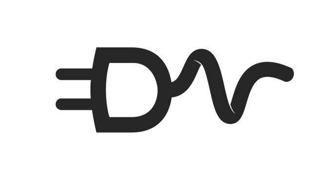
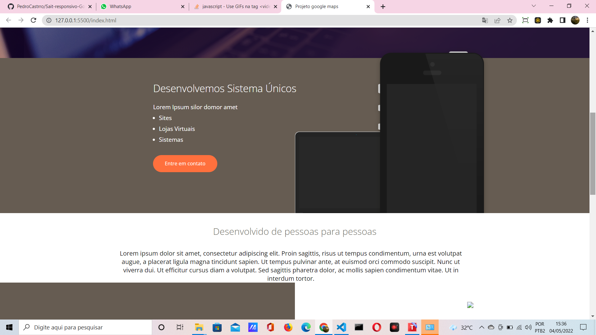
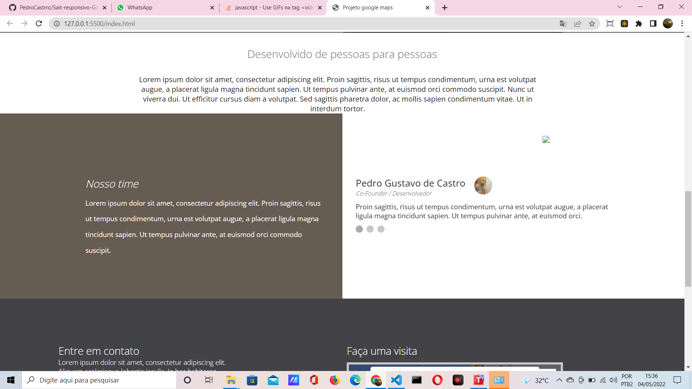
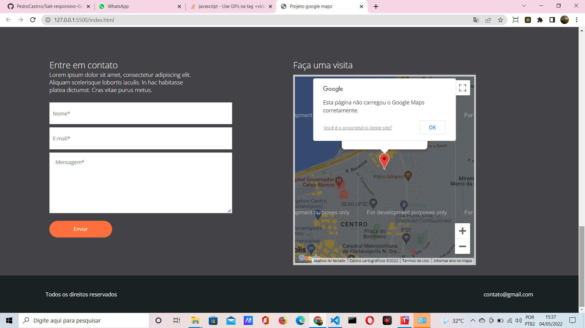

### READEME
##Projeto implementaçao de google maps 

Nesse site foi usado html , css e javascript

<h2>Projeto implementaçao de google maps  Redesigin</h2>

Abaixo fotos, gif e video

 
 
 
 

 

<h4 aling="center">   Projeto implementaçao de google maps ⛔ Em construção... </h4> 

## Features  

[x]filtre por buscas
[]filtre por ano
[]Slides em js
[x]transição de pagina em html
[x]stylização
[x]formulario
[x]home nav
